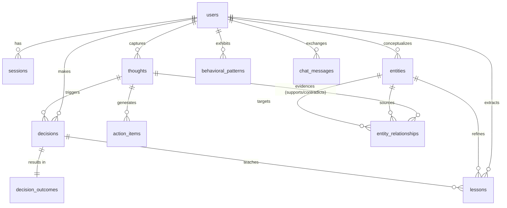

# Domain Model & ER Diagram
**Version:** 1.0.0  
**Status:** Frozen  

This document details the database domain schema, entity relations, index strategies, and cascade delete rules for the **Cognitive Loop** database layer.

---

## 1. Entity Relationship (ER) Diagram

---

## 2. Table Schemas & Foreign Keys

### Users & Sessions
*   `users`: Stores user identity, authentication hashes, and profile metadata.
*   `sessions`: Manages short-lived cookie session tokens.
    *   *Fk Constraint*: `userId` $\rightarrow$ `users.id` `ON DELETE CASCADE`.

### Episodic Memory Layer
*   `thoughts`: The core ledger of raw captures. Contains summaries, sentiments, JSON tags, and the serialized 768-dim embedding float vector.
    *   *Fk Constraint*: `userId` $\rightarrow$ `users.id` `ON DELETE CASCADE`.

### Semantic Memory Layer (PKG)
*   `entities`: Evolving concepts derived by entity extraction. Includes types (Goal, Tech, Project, Person) and aliases.
    *   *Fk Constraint*: `userId` $\rightarrow$ `users.id` `ON DELETE CASCADE`.
*   `entity_relationships`: Semantic edges between entities. Contains taxonomy types, confidence ratings, and JSON string arrays mapping back to the supporting/contradicting `thought` UUIDs.
    *   *Fk Constraint*: `sourceEntityId` $\rightarrow$ `entities.id` `ON DELETE CASCADE`.
    *   *Fk Constraint*: `targetEntityId` $\rightarrow$ `entities.id` `ON DELETE CASCADE`.

### Decision Intelligence Layer
*   `decisions`: Captures the core goal, metrics, and date of decisions.
    *   *Fk Constraint*: `userId` $\rightarrow$ `users.id` `ON DELETE CASCADE`.
    *   *Fk Constraint*: `thoughtId` $\rightarrow$ `thoughts.id` `ON DELETE SET NULL` (preserving the decision even if the original raw thought is deleted).
*   `decision_outcomes`: Immutable logged outcomes of decisions.
    *   *Fk Constraint*: `decisionId` $\rightarrow$ `decisions.id` `ON DELETE CASCADE`.
*   `lessons`: Actionable takeaways extracted from decision outcomes.
    *   *Fk Constraint*: `userId` $\rightarrow$ `users.id` `ON DELETE CASCADE`.
    *   *Fk Constraint*: `decisionId` $\rightarrow$ `decisions.id` `ON DELETE SET NULL`.
    *   *Fk Constraint*: `entityId` $\rightarrow$ `entities.id` `ON DELETE CASCADE`.

### Procedural Memory Layer
*   `behavioral_patterns`: Evolving observations of the user's cognitive patterns.
    *   *Fk Constraint*: `userId` $\rightarrow$ `users.id` `ON DELETE CASCADE`.

---

## 3. Database Indexes

To maintain performance, we place indexes on key querying boundaries:

| Index Name | Table | Column(s) | Primary Purpose |
|---|---|---|---|
| `thoughts_user_created_idx` | `thoughts` | `(userId, createdAt)` | Optimizes list rendering and chronological search. |
| `entities_user_name_idx` | `entities` | `(userId, name)` | Optimizes entity lookup and duplicate prevention checks. |
| `relations_source_target_idx` | `entity_relationships` | `(sourceEntityId, targetEntityId)` | Optimizes knowledge graph traversal. |
| `decisions_expected_outcome_idx` | `decisions` | `expectedOutcomeDate` | Optimizes the background job querying for overdue outcomes. |
