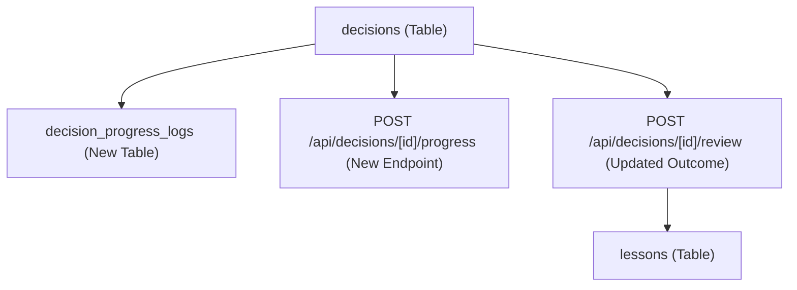

# Phase 5: Decision Evolution & Retrospective Synthesis

This phase focuses on upgrading decisions from simple static logs to chronological timeline logs with progress notes, mid-course AI insight summaries, trashed decision statuses, and Case Study linking inside the Lessons Vault.

---

## 🎯 Objectives
1. **Decision Progress Tracking**: Add the ability for users to record chronological "Progress Notes" for any active decision.
2. **Mid-Course AI Insights**: Automatically generate an AI-driven "Evolution Insight" summarizing the progression and offering suggestions once at least one progress note is logged.
3. **Flexible Closures (Success, Failed, Trashed)**: Support resolving a decision as Success, Failed, or Trashed (Abandoned). Trashed decisions are logged for historical context but do not extract lessons.
4. **Distilled Lessons & Case Studies**: Modify the Lessons Vault to show the lesson as a rule-of-thumb, linking directly to the parent decision's full progress log as a Case Study.
5. **Horizontal Tab Switcher & Filters**: Refactor the decisions UI to use horizontal tabs (Active vs. Historical) and add filters for Status, Created Time, and Target Date.

---

## 🏗️ Architectural Plan

### 1. Database Changes
*   Create a new table `decision_progress_logs` referencing `decisions.id`.
*   Add `evolutionInsight` and `finalSynthesis` columns to the `decisions` table.

### 2. API Routes
*   `POST /api/decisions/[id]/progress`: Add a new progress note to a decision. Run background AI summarization to update `evolutionInsight`.
*   `POST /api/decisions/[id]/review`: Close the decision (Success/Failed/Trashed). If Success or Failed, run Groq pipeline to extract lessons and save `finalSynthesis`.

### 3. UI Adjustments
*   **Active Tab**: Inline text area to add progress notes; "Review & Close" button for final status selection.
*   **Historical Tab**: Renders closed cards. Expands to show progress timeline stacks and the final AI summary.
*   **Lessons Vault**: Renders extracted wisdom, with a dropdown to view the parent decision's case study.
