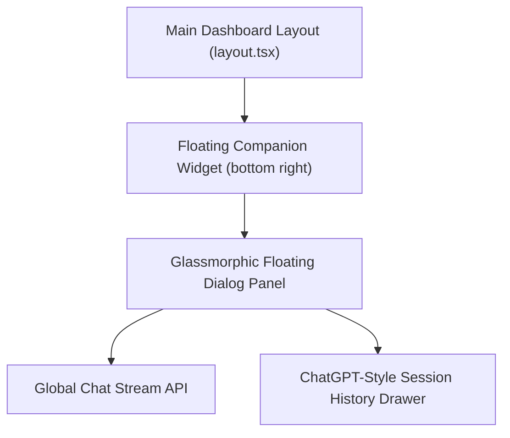

# Phase 5: Global Thinking Companion

This phase focuses on introducing the Jarvis companion assistant universally across the workspace as a globally accessible, floating chatbot widget with ChatGPT-style conversation history drawers.

---

## 🎯 Objectives
1. **Global Floating Thinking Companion**: Remove the full-screen Companion route. Introduce a persistent, interactive floating chat bubble in the bottom right corner of the dashboard screen. Tapping it opens a glassmorphic sidebar/dialog to chat with Jarvis globally.
2. **GPT-Style Sessions Drawer**: Integrate a side panel inside the chat overlay to toggle and browse prior conversations.

---

## 🏗️ Architectural Plan

### 1. File Modifications
*   `src/app/dashboard/layout.tsx`: Load the `FloatingCompanionWidget` globally.
*   `src/components/FloatingCompanionWidget.tsx` [NEW]: Implements the button toggler, popover chat interface, and conversation session switcher.

---

## 🧪 Verification Plan
*   **Global Access**: Test opening the companion from Timeline, Graph, and Ledger screens.
*   **Session Switching**: Verify that switching conversations loads the correct historical context.
